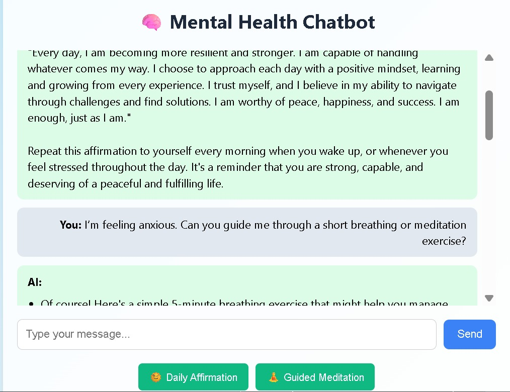

# 🧠 Mental Help MindMate – AI Chatbot

A GenAI-powered mental health assistant that offers calming conversation, daily affirmations, and guided meditation.  
Built using **React.js** (frontend), **Node.js/Express** (backend), and **OpenRouter API** (Mistral-7B LLM).

---

## 🌟 Features

- 🤖 Context-aware AI replies via Mistral-7B through OpenRouter API
- 🌞 One-click daily affirmation generation
- 🧘 Instant guided meditation prompts
- 💬 Persistent chat memory (client-side)
- 🎨 Clean responsive UI (normal CSS)

---

## 🛠️ Tech Stack

| Frontend   | Backend     | API / Model             | Tools              |
|------------|-------------|-------------------------|--------------------|
| React.js   | Node.js     | OpenRouter + Mistral-7B | Git, VS Code, Axios|
| HTML, CSS  | Express.js  | REST API                |                   |

---

## 📸 Demo Screenshot



---

## 📂 Folder Structure

```
MindMate/
├── mindmate-client/
│   ├── public/
│   │   └── mindmatw/
│   │       └── mindmate.jpg
│   └── src/
│       ├── App.js
│       ├── index.js
│       └── App.css
│   └── package.json
│   └── vite.config.js
├── server/
│   ├── index.js
│   ├── .env
│   └── package.json
├── .gitignore
└── README.md
```

---

## 🚀 Run Locally

### 1. Clone the repository
```bash
git clone https://github.com/kaushlesh79/Mental-Help-Mindmate-AI-Chatbot.git
cd Mental-Help-Mindmate-AI-Chatbot
```

### 2. Setup Backend (Node.js + Express)
```bash
cd server
npm install
touch .env   # Add your OpenRouter key

# .env content:
OPENROUTER_API_KEY=your_api_key_here

node index.js
```

### 3. Setup Frontend (React + Vite)
```bash
cd ../mindmate-client
npm install
npm run dev
```

---

## 🧑‍💻 Author

**Kaushlesh Chaurasiya**  
[GitHub](https://github.com/kaushlesh79) | [LinkedIn](https://www.linkedin.com/in/kaushlesh-chaurasiya)

---

## 📃 License

This project is for learning and demo purposes only.
